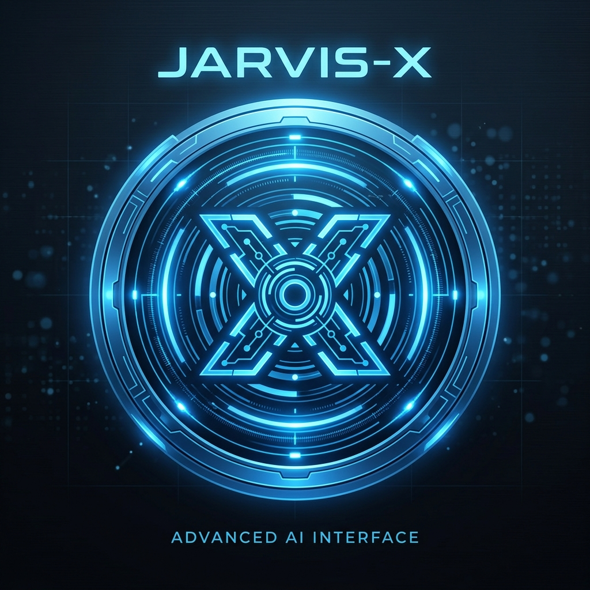

<div align="center">
  

  # ⚡ JARVIS-X
  **The Ultimate AI-Driven Local Agent Built for Power Users**

  <p>
    <a href="https://github.com/Alinshan/JARVIS-X/stargazers"></a>
    <a href="https://github.com/Alinshan/JARVIS-X/network/members"></a>
    <a href="https://github.com/Alinshan/JARVIS-X/issues"></a>
    <a href="https://github.com/Alinshan/JARVIS-X/blob/main/LICENSE"></a>
  </p>

  <i>Created with ❤️ by <b>Alinshan</b></i>
</div>

---

## 🌟 Overview

**JARVIS-X** is your personal, highly intelligent AI assistant that lives directly on your computer. Leveraging state-of-the-art Large Language Models via the Gemini API, JARVIS-X doesn't just chat—it **does**. From visual screen analysis to fluid voice commands and deep system control, JARVIS-X bridges the gap between your desktop and human intent. 

Say goodbye to manual clicks and embrace a fully automated, sci-fi digital experience.

---

## 🔥 Next-Generation Capabilities

| Feature | Description |
| :--- | :--- |
| 📱 **Full Remote Phone Control** | Take command of your entire desktop operating system directly from your smartphone, from anywhere, at any time. |
| 🧠 **Advanced Long-Term Memory** | Upgraded memory architecture allows JARVIS-X to contextually remember past interactions, preferences, and complex workflows across system reboots. |
| 🚀 **Powered by Gemini API** | Engineered from the ground up to utilize the full speed and precision of Google's Gemini models for ultimate reasoning and cognitive stability. |
| ⚡ **Unmatched Performance** | Comprehensive system-wide optimizations deliver incredibly fast response times and rock-solid execution across Windows, macOS, and Linux. |
| 📂 **Hybrid Input & File Handling** | Fluidly switch between voice and keyboard input. Drag-and-drop code, PDFs, or images for instant analysis and seamless automation. |
| 🔒 **Secure Mobile File Sharing** | Wirelessly and securely share files or entire folders (up to 500 MB) from your phone directly to your computer with absolute local privacy. |
| 👁️ **Real-Time Computer Vision** | JARVIS-X actively analyzes your screen to gain full context of your ongoing tasks and visual environment. |
| 🗣️ **Fluid Voice Interaction** | Converse naturally with ultra-low latency speech recognition and fluid conversational logic in any language. |

---

## 🚀 Getting Started

It takes only a few minutes to bring JARVIS-X to life. No hidden subscriptions, no data harvesting—your data stays entirely with you.

### 📋 Prerequisites

| Requirement | Specification |
| :--- | :--- |
| **OS** | Windows 10/11, macOS, or Linux |
| **Python** | 3.11 or 3.12 |
| **Hardware** | Microphone (Required for voice) |
| **API Key** | Free [Google Gemini API Key](https://aistudio.google.com/app/apikey) |

### 🛠️ Step-by-Step Installation Guide (For Beginners)

Follow these simple steps to get JARVIS-X running on your computer.

**Step 1: Install Python & Git**
- **Python:** Download and install [Python 3.11 or 3.12](https://www.python.org/downloads/). *Important: During installation on Windows, make sure to check the box that says "Add Python to PATH".*
- **Git:** Download and install [Git](https://git-scm.com/downloads) if you don't already have it.

**Step 2: Get Your Free Gemini API Key**
- Go to Google's [AI Studio](https://aistudio.google.com/app/apikey).
- Sign in with your Google account and click **Create API Key**.
- Save this key somewhere safe—you'll need it when you launch JARVIS-X for the first time.

**Step 3: Download JARVIS-X**
Open your terminal (Command Prompt on Windows, or Terminal on Mac/Linux) and run the following commands:
```bash
# Download the project
git clone https://github.com/Alinshan/JARVIS-X.git

# Enter the project folder
cd JARVIS-X
```

**Step 4: Install Required Packages**
While inside the JARVIS-X folder in your terminal, run:
```bash
# Install core Python dependencies
pip install -r requirements.txt

# Install Playwright browsers (used for web searching)
playwright install
```
> 💡 **Troubleshooting:** If you get a `ModuleNotFoundError` for `PyQt6` when launching, simply run `pip install PyQt6` to install the graphical interface library manually.

**Step 5: Launch JARVIS-X!**
```bash
python main.py
```
*On first launch, JARVIS-X will ask for your Gemini API key. Paste the key you got in Step 2, and you are ready to command your AI!*

---

## 🔒 Privacy & Security First

**Your Data. Your Rules.**  
JARVIS-X uses your own API keys, guaranteeing zero middleman telemetry. Furthermore, the remote mobile dashboard operates exclusively over your local Wi-Fi, ensuring absolute security and isolation from the outside web.

---

## 📜 License

This software is released under the **[MIT License](https://opensource.org/licenses/MIT)**. You are completely free to modify, distribute, and use it for any purpose.

---

<div align="center">
  <b>Engineered by <a href="https://github.com/Alinshan">Alinshan</a></b><br>

  
  <i>Support the development of JARVIS-X by giving it a ⭐ on GitHub!</i>
</div>